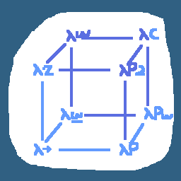

## Lambda cube and more ++
Learn some type theory by doing.

#### List of languages
- lambda calculus `cabal run LC`
- simply typed lambda calculus `cabal run STLC`
- λω  `cabal run LM`
- λP2 `cabal LP2`
- pcf `cabal run PCF`
